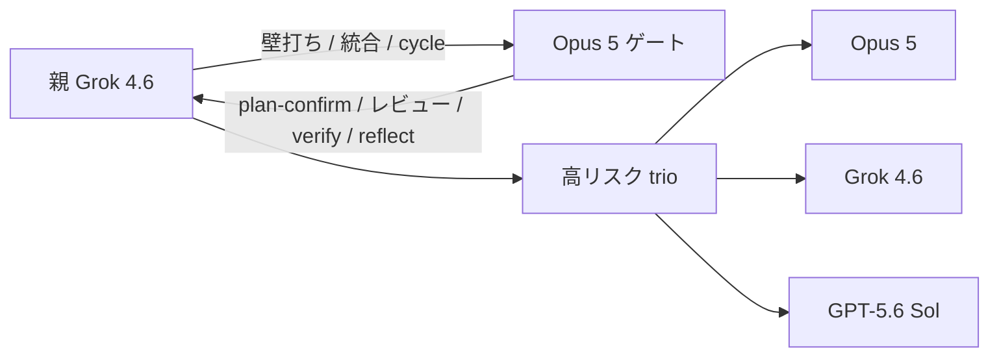
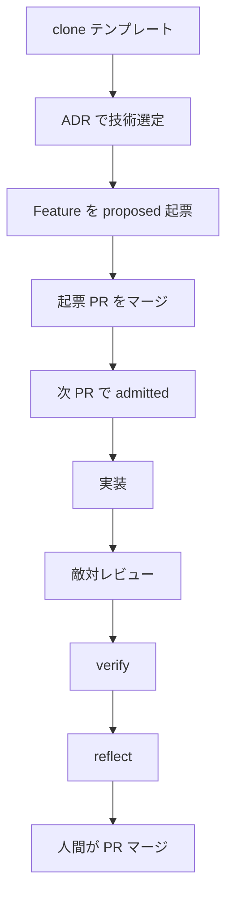

# cursor-harness

プロダクトを含まない Cursor ハーネスの**テンプレート**。製品を作る前にここから切る（[[0039]]）。

## 何をするか

- 席: 親 Grok 4.6 / Opus ゲート / Sol は3体多数決のみ
- 正本: `knowledge/features/F-NNNN-*.yaml`
- 入場: OPA `node scripts/feature-gate.mjs`
- 管理: skill の使用/省略を `knowledge/graph/` に書き、ノード / 辺 / 状態の3指標で計る
- 再起: 人間が PR をマージしたあと、省略が残っていれば次 Feature の下書き PR を開く（エージェントは自動起動しない）
- パッケージ: pnpm（[[0041]]）
- commit: hook 必須。主語は `feat:` / `fix:` / `docs:` 等 + 日本語（[[0042]]）

使い方は `TEMPLATE.md`。

## 設計概要

### 通常のモデルフロー

1周の席。親は常時 Grok。Claude は名前付き Task のみ。Fable は天井判断だけでこの図に入れない。



### 設計フロー

製品もハーネス改善も、実装から入らない直線の1周（[[0039]]）。再起は次の図。



### 再起的フロー

人間がマージしたあとだけ回る。hooks から Task は起動しない。省略も失敗も無い周は止める。


## 構成

```
.claude/          エージェント / skill / hook
.cursor/          Cursor の hook
knowledge/        ADR / 判断基準 / Feature / グラフ / 内省
policy/           OPA（入場と cycle）
scripts/          feature-gate / cycle-* / githooks / commit-msg
```

## 置かないもの

認証・課金・UI・DB・e2e・配信・案件グラフ。それらは製品リポに足す。

## 由来

元リポジトリ: [marumo333/jp-code-agent](https://github.com/marumo333/jp-code-agent)。
製品コードは含めない（[[0039]]）。
