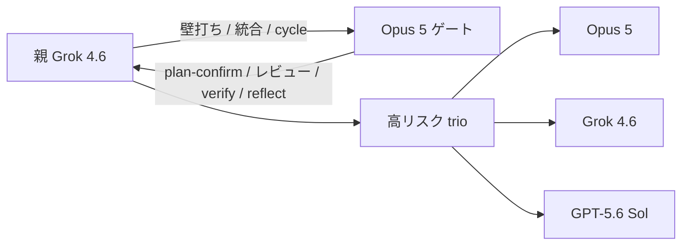
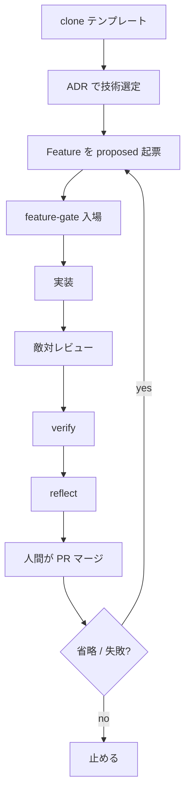

# cursor-harness

プロダクトを含まない Cursor ハーネスの**テンプレート**。製品を作る前にここから切る（[[0039]]）。

## 何をするか

- 席: 親 Grok 4.6 / Opus ゲート / Sol は3体多数決のみ
- 正本: `knowledge/features/F-NNNN-*.yaml`
- 入場: OPA `node scripts/feature-gate.mjs`
- 管理: skill の使用/省略を `knowledge/graph/` に書き、ノード / 辺 / 状態の3指標で計る
- 再起: 人間が PR をマージしたあと、省略が残っていれば次 Feature の下書き PR を開く（エージェントは自動起動しない）
- パッケージ: pnpm（[[0041]]）

使い方は `TEMPLATE.md`。

## 設計概要





## 構成

```
.claude/          エージェント / skill / hook
.cursor/          Cursor の hook
knowledge/        ADR / 判断基準 / Feature / グラフ / 内省
policy/           OPA（入場と cycle）
scripts/          feature-gate / cycle-*
```

## 置かないもの

認証・課金・UI・DB・e2e・配信・案件グラフ。それらは製品リポに足す。
