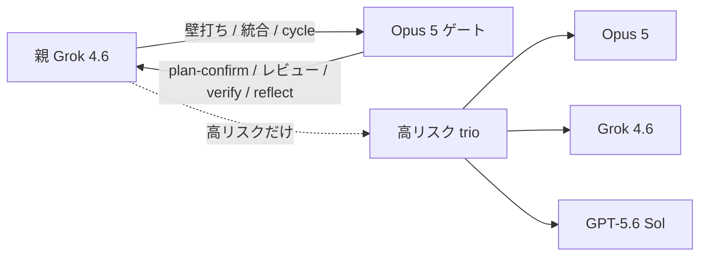
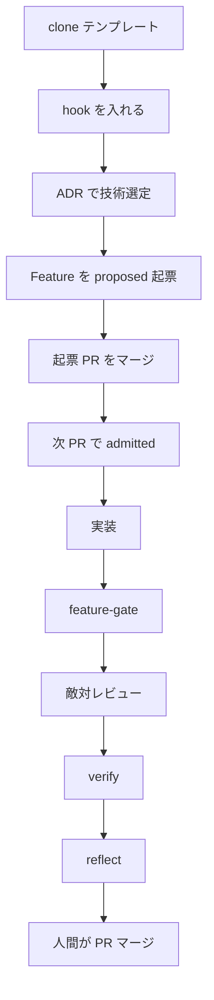
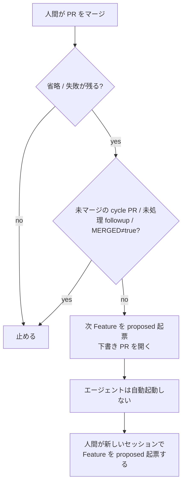

# cursor-harness

プロダクトを含まない Cursor ハーネスの**テンプレート**。製品を作る前にここから切る（[ADR 0039](knowledge/decisions/0039-harness-template-cycle-graph.md)）。

## 何をするか

- 席: 親 Grok 4.6 / Opus 5 ゲート / Sol は**高リスク3体多数決のみ**
- 正本: [`knowledge/features/F-NNNN-*.yaml`](knowledge/features/README.md)。GitHub Issues / Spec Kit は正本にしない（[ADR 0033](knowledge/decisions/0033-harness-api-budget-routing.md)）
- 入場: OPA `node scripts/feature-gate.mjs`
- 出生規則: Feature は `proposed` で起票する。**同一 PR で `admitted` / `approved` にしない**（[ADR 0038](knowledge/decisions/0038-feature-canon-opa-grow.md)）
- 管理: skill の使用/省略を `knowledge/graph/` に書き、ノード / 辺 / 状態の3指標で計る
- 再起: 人間が PR をマージしたあと、省略が残っていれば次 Feature の下書き PR を開く（エージェントは自動起動しない）。戻る先は Feature 起票であり、clone からやり直さない
- パッケージ: pnpm（[ADR 0041](knowledge/decisions/0041-pnpm-package-manager.md)）
- commit: hook 必須。主語は `feat:` / `fix:` / `docs:` 等 + 日本語（[ADR 0042](knowledge/decisions/0042-always-on-precommit-ja-conventional.md)）

手順の本体は [TEMPLATE.md](TEMPLATE.md)。

## 最初にやること

clone の直後は実装に入らない。hook を入れてから ADR → Feature 起票へ進む。

```bash
git clone https://github.com/marumo333/cursor-harness.git
cd cursor-harness
node scripts/install-git-hooks.mjs
```

前進の確認は `node scripts/feature-gate.mjs`（[ADR 0016](knowledge/decisions/0016-definition-of-done.md)）。ハーネスにテストがある変更は `pnpm test`。

## 設計概要

### 通常のモデルフロー

1周の席。親は常時 Grok。Claude は名前付き Task のみ。plan-confirm は並列展開前だけ。trio は高リスクのときだけ。Fable は天井判断だけでこの図に入れない。



### 設計フロー

製品もハーネス改善も、実装から入らない直線の1周（[ADR 0039](knowledge/decisions/0039-harness-template-cycle-graph.md)）。同一 PR で admitted にしない。再起は次の図。



### 再起的フロー

人間がマージしたあとだけ回る。hooks から Task は起動しない。省略も失敗も無い周、および空サイクルの integrity=0 だけでは止める。clone と最初の ADR 選定は繰り返さない。



## 構成

```
.claude/          エージェント / skill / hook
.cursor/          Cursor の hook
knowledge/        ADR / 判断基準 / Feature / グラフ / 内省
policy/           OPA（入場と cycle）
scripts/          feature-gate / cycle-* / githooks / commit-msg
```

Feature の起票手順は [`knowledge/features/README.md`](knowledge/features/README.md)。

## 置かないもの

認証・課金・UI・DB・e2e・配信・案件グラフ。それらは製品リポに足す。

## 由来

元リポジトリ: [marumo333/jp-code-agent](https://github.com/marumo333/jp-code-agent)。
製品コードは含めない（[ADR 0039](knowledge/decisions/0039-harness-template-cycle-graph.md)）。
